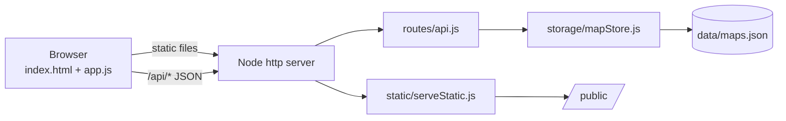

# Relationship Exploration Map

*Mapa Relacional Interactivo*: an interactive, mirrored game board for exploring a relationship's attachment, boundaries, reciprocity and repair.


-lightgrey)

## Project Overview

A small web application that represents a romantic relationship as a **Minesweeper-inspired, mirrored board**. The centre column is the couple's secure base. The left half belongs to one partner and the right half to the other. Each of the 110 side blocks holds a concrete relationship situation (trust, communication, intimacy, life project, boundaries). Partners take turns unlocking blocks, mark non-negotiables as **mines**, record blocks as reflected, and attach notes. Anything that happens on one side is **mirrored** on the other, which is how the board encodes reciprocity. Maps can be saved and reloaded through a small REST API.

The UI is in Spanish.

## Project Context

**Personal Project** (an MVP / proof of concept), built in March 2026.

- The product vision says the idea *"comes from a very personal and emotional intuition"*.
- It was deployed on the author's personal domain (`relaciones.baruchlopez.com`).
- Nothing indicates academic or commissioned work.

See [docs/project-context.md](docs/project-context.md) for the evidence, timeline and known inconsistencies.

## Problem Statement

People often read relationships through simple rules ("if they loved me they wouldn't want space"). They have no shared map for telling apart healthy exploration from threat, autonomy from abandonment, or real non-negotiables from unprocessed fear. Talking about these things directly tends to escalate.

## Objective

Make attachment, reciprocity, limits and relational maturity **visible and playable**, so that a couple can talk *about the map* instead of at each other. The tool is for conversation and reflection. It **does not diagnose** and **does not replace therapy**.

## Repository Structure

```text
.
├── public/            # Frontend: index.html, assets/app.js (game rules), styles.css, images/*.svg
├── src/server/        # Backend: Node http server, REST routes, JSON storage, static serving
├── server.js          # Legacy entry point (requires src/server/index.js)
├── tests/             # node:test unit tests for the storage module
├── scripts/           # smoke test, local host check, secret scanner
├── ops/nginx/         # Nginx config for the local Docker stack
├── data/              # Runtime storage (maps.json is generated and git-ignored)
├── Dockerfile, docker-compose.local.yml, .env.example
├── AGENTS.md          # Original contributor / coding-agent guidelines
├── specs/             # Retrospective intent, spec and plan
├── docs/              # English documentation
│   └── original/      # Original Spanish documents, unchanged
└── archive/           # First single-file prototype, restored from git history
```

## Original Implementation

This repository preserves the original implementation of the project. The source code has intentionally not been refactored or modernized in order to retain the historical context and original development approach.

The source code represents the original implementation developed as a personal project. Every file under `public/`, `src/`, `scripts/`, `tests/` and `ops/`, and the root config files, is unchanged. Known issues are documented, **not fixed**, in [docs/possible-improvements.md](docs/possible-improvements.md).

## Technologies

| Area | Technology |
|---|---|
| Backend | Node.js (≥ 18), built-in `http`, `fs`, `crypto`, CommonJS. No npm dependencies |
| Frontend | HTML5 (`<dialog>`), CSS custom properties, vanilla JavaScript (`fetch`) |
| Persistence | Local JSON file (`data/maps.json`) with atomic writes |
| Testing | Node built-in test runner (`node --test`) |
| Local infra | Docker, Docker Compose, Nginx 1.27 (Alpine) |
| Production (observed) | Docker + Traefik + Let's Encrypt |

## How It Works

1. **Board:** an 11×11 grid. Column 5 is the shared centre; each theme sits at a fixed distance from it (Trust 1 … Boundaries 5), with 11 situations per theme.
2. **Turns:** 👨 starts next to the centre on the left and 👩 on the right. On each turn a player picks an orthogonally adjacent block **on their own side**. A modal explains the situation and offers **Unlock** or **Skip**.
3. **Mirror:** unlocking a block also unlocks the mirror block for the partner (faint colour = unlocked by reflection). Mines and "reflected" marks are mirrored too.
4. **Mines:** in mine mode a player toggles a non-negotiable on their side. Neither player can unlock a mined block.
5. **Feedback:** counters (explored, active mines, reflected) and an **exploration radar** that labels each player *Conservador/a*, *Intermedio/a* or *Aventurero/a* from how far and how often they moved.
6. **Persistence:** the browser sends the whole map (title, mode, board, notes) to the API. The server normalises it and stores it in `data/maps.json`.

The exact rules are in [docs/code-overview.md](docs/code-overview.md).

## Architecture



| Endpoint | Purpose |
|---|---|
| `GET /api/health` | Health check |
| `GET /api/maps` | List saved maps (summaries) |
| `POST /api/maps` | Create a map |
| `GET /api/maps/:id` | Load a map |
| `PUT /api/maps/:id` | Update a map |

Details are in [docs/architecture.md](docs/architecture.md).

## Running the Project

These commands come from the original `package.json` and docs.

```bash
npm install                  # no third-party packages; only checks the lockfile
APP_PORT=8080 npm run dev    # http://localhost:8080
npm test                     # unit tests
npm run smoke                # with the server running
npm run security:scan        # secret scan
```

Optional local VPS-like stack (Docker + Nginx, `http://mapa.localhost`):

```bash
npm run local:stack:up
npm run local:stack:check
npm run local:stack:down
```

More in [docs/operations.md](docs/operations.md).

## Documentation

| Topic | Link |
|---|---|
| Documentation index | [docs/README.md](docs/README.md) |
| Project context and history | [docs/project-context.md](docs/project-context.md) |
| Product vision (English summary) | [docs/product-vision.md](docs/product-vision.md) |
| Research behind the 55 situations | [docs/research-basis.md](docs/research-basis.md) |
| Architecture | [docs/architecture.md](docs/architecture.md) |
| Code overview and game rules | [docs/code-overview.md](docs/code-overview.md) |
| Running, testing, deploying | [docs/operations.md](docs/operations.md) |
| Possible improvements (not applied) | [docs/possible-improvements.md](docs/possible-improvements.md) |
| Intent, spec, plan | [specs/](specs/README.md) |
| Original Spanish documents | [docs/original/](docs/original/README.md) |
| First prototype | [archive/](archive/README.md) |

## Responsible Use

This app does not diagnose and does not replace therapy. It is a tool for opening conversations and seeing agreements, asymmetries and repair processes. It must not be used to pressure or manipulate a partner.

## Historical Note

This repository was later reorganized and documented to improve readability and preserve the historical context of the original project. The original source code remains unchanged. The changes were limited to:

- a new English `README.md`,
- English documentation in `docs/`,
- retrospective `specs/`,
- moving the original Spanish documents (including the original README) into `docs/original/`,
- restoring the first prototype from git history into `archive/`.
