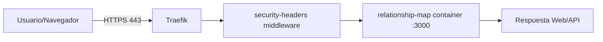

# Cómic técnico — Relationship Exploration Map

## Episodio 1: "La visita a Relaciones"

**Panel 1 — El visitante**
> Usuario: "Quiero entrar a relaciones.baruchlopez.com"

**Panel 2 — El guardia de la puerta (Traefik)**
> Traefik: "Pásale, pero por HTTPS y con certificado válido."

**Panel 3 — Escudo activado**
> Middleware `security-headers`: "Nada de frames, nada de sniffing raro, CSP estricta."

**Panel 4 — Entrega interna**
> Traefik: "Router `relaciones`, te envío al servicio en puerto 3000."

**Panel 5 — El cerebro de la app**
> Node.js (`src/server/index.js`): "Aquí está tu frontend/API."

**Panel 6 — Final feliz**
> Usuario: "Cargó rápido y seguro." ✨

## Mapa visual rápido

