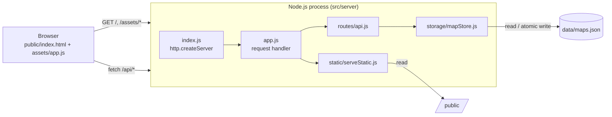

# Architecture

This describes the architecture **as implemented** in the original code. It is based on `src/server/`, `public/` and the original [`ARCHITECTURE.md`](original/ARCHITECTURE.md). Nothing here was added during the reorganization.

## Overview

A small, dependency-free Node.js application. One process serves both the static frontend and a JSON REST API, and stores data in a local JSON file.



There are three layers, as named in the original docs:

1. **Presentation** (`public/`): the UI and **all game rules** (turns, adjacency, mirroring, mines, analytics) run in the browser.
2. **Application/API** (`src/server/routes/`): a thin REST router.
3. **Persistence** (`src/server/storage/`): input normalisation and JSON-file storage.

**Confirmed:** the server knows nothing about game rules. It stores whatever board snapshot the client sends, after normalising it.

## Backend modules

| Module | Responsibility |
|---|---|
| `server.js` | One-line legacy entry point: `require("./src/server/index")`. |
| `src/server/index.js` | Bootstrap: builds the `mapStore`, ensures the data file exists, starts `http.createServer` on `config.host:config.port`. |
| `src/server/config.js` | Reads `HOST`, `APP_PORT` (takes priority) and `PORT` (default `8080`); 1 MB body limit; resolves `public/` and `data/maps.json`. |
| `src/server/app.js` | Request handler: parses the URL, tries API routes, otherwise serves static files for `GET` (other methods get `405`). Catches errors and returns `500`. |
| `src/server/routes/api.js` | `/api/*` routing and HTTP error mapping. |
| `src/server/http/*` | `sendJson` / `sendText`, `readJsonBody` (size limit, JSON parse), `httpError(statusCode, message)`. |
| `src/server/static/serveStatic.js` | Static file serving from `public/` with a path-traversal guard, a content-type map and `Cache-Control: no-store`. |
| `src/server/storage/mapStore.js` | `normalizeMapInput` + `createMapStore({ filePath })` with `ensureStore`, `listSummaries`, `getById`, `create`, `update`. |

## REST API

| Method | Path | Behaviour | Responses |
|---|---|---|---|
| `GET` | `/api/health` | `{ status: "ok", service, now }` | 200 |
| `GET` | `/api/maps` | `{ items: [{ id, title, people, updatedAt, createdAt }] }`, sorted by `updatedAt` descending | 200 |
| `POST` | `/api/maps` | Normalises the body and creates a map with a `randomUUID()` id | 201, 400 (invalid JSON), 413 (> 1 MB) |
| `GET` | `/api/maps/:id` | Full map | 200, 404 |
| `PUT` | `/api/maps/:id` | Replaces the normalised fields; keeps `id` and `createdAt`; refreshes `updatedAt` | 200, 400, 404, 413 |
| other | `/api/maps/:id` | | 405 |
| any | other `/api/*` | | 404 |

`:id` must match `[A-Za-z0-9-]+`. Errors are returned as `{ "error": "<message>" }`.

## Data model (as stored)

```jsonc
{
  "id": "uuid",
  "createdAt": "ISO-8601",
  "updatedAt": "ISO-8601",
  "title": "string ≤120 (default 'Mapa sin titulo')",
  "people": { "personA": "≤80 (default 'Persona A')", "personB": "≤80 (default 'Persona B')" },
  "notes": { "r,c": "string ≤1200, trimmed, empty removed" },
  "boardState": {
    "size": "int 3–31 (default 11)",
    "center": "int (default floor(size/2))",
    "cells": [{
      "r": 0, "c": 0,
      "center": false, "unlocked": false, "completed": false,
      "mine": false, "disarmed": false, "reflected": false,
      "key": "≤40", "label": "≤80", "text": "≤220"
    }]
  },
  "mode": "explore | mine | complete | transform | reflect (default explore)"
}
```

**Confirmed (by sending a request to the running server):** the frontend sends more fields than the store keeps. The normaliser **drops** `boardState.turn`, `boardState.players`, and the per-cell `directUnlocked`, `mirroredUnlocked`, `mirroredBy` and `section`. When a map is reloaded, `section` is rebuilt from the static board layout. Turn, player positions and the direct/mirror distinction are lost. See [possible-improvements.md](possible-improvements.md).

## Persistence strategy

- One JSON array in `data/maps.json`, created on start-up if it is missing. The file is ignored by git.
- Every write serialises the whole array to `maps.json.tmp` and then calls `fs.renameSync` (an atomic replace).
- Every read parses the whole file. If parsing fails, it is treated as an empty list.
- All file access is synchronous. There is no locking, so concurrent writers follow last-write-wins.

## Frontend architecture

A single classic script (`public/assets/app.js`, about 870 lines) with no framework and no build step:

- **Static content:** `SITUATION_LIBRARY` (5 themes × 11 situations) → `ZONES` → mapped onto both mirror columns.
- **State:** one `appState` object (board matrix, notes, selection, current map id, turn, player positions, UI flags).
- **Rendering:** `render()` rebuilds the whole board as `<button>` elements on every change. `renderSelectionOnly()` handles hover.
- **Game rules:** `unlockCellForCurrentTurn`, `skipCellForCurrentTurn`, `handleCellClick` (mine and reflect modes). Mirroring goes through one helper, `applyMirror`.
- **Analytics:** `computeExplorationStats` / `classifyExploration` → the "Radar de exploración".
- **API client:** `api()`, a `fetch` wrapper used by `checkHealth`, `refreshMaps`, `saveMap` and `loadMap`.

See [code-overview.md](code-overview.md) for the detailed rules.

## Deployment topologies

| Environment | Topology | Source |
|---|---|---|
| Local (Node only) | `npm run dev` → `:8080` | `package.json` |
| Local (VPS-like) | Docker Compose: `app` (Node 20 Alpine, `:8080`) behind `nginx:1.27-alpine` on `:80`, host-based routing for `mapa.localhost` | `docker-compose.local.yml`, `ops/nginx/local.conf` |
| Generic VPS (documented) | systemd service + Nginx reverse proxy + Certbot | [`original/DEPLOY_VPS.md`](original/DEPLOY_VPS.md) |
| Production (observed) | Docker container behind **Traefik** with Let's Encrypt and a security-headers middleware, internal port `3000` | [`original/DEPLOYMENT_ARCHITECTURE_PROD.md`](original/DEPLOYMENT_ARCHITECTURE_PROD.md) |

Details are in [operations.md](operations.md).
