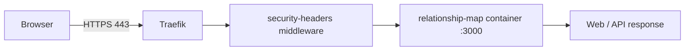

# Operations: Running, Testing and Deploying

English consolidation of the original operational docs:
[`LOCAL_TESTING.md`](original/LOCAL_TESTING.md), [`DEPLOY_VPS.md`](original/DEPLOY_VPS.md), [`DEPLOYMENT_ARCHITECTURE_PROD.md`](original/DEPLOYMENT_ARCHITECTURE_PROD.md), [`ARCHITECTURE_COMIC.md`](original/ARCHITECTURE_COMIC.md) and [`WIX_SUBDOMINIO_MANUAL.md`](original/WIX_SUBDOMINIO_MANUAL.md).
All commands below come from `package.json` or from those documents.

## Requirements

- Node.js **18 or newer** (`engines` in `package.json`). The Docker image uses Node 20.
- No third-party npm packages. `npm install` only creates or validates the lockfile.
- Optional: Docker with Compose, for the local VPS-like stack.

## Configuration

| Variable | Default | Meaning |
|---|---|---|
| `HOST` | `0.0.0.0` | Bind address |
| `APP_PORT` | none | Takes priority over `PORT`. It was added because some environments inject a random `PORT` |
| `PORT` | `8080` | Listening port when `APP_PORT` is not set |
| `BASE_URL` | `http://127.0.0.1:<APP_PORT or 8080>` | Used by `npm run smoke` only |
| `LOCAL_CHECK_PORT` | none | Used by `npm run local:check` only |

Data is written to `data/maps.json`, which is created automatically and ignored by git.

## Option A: Node only

```bash
npm install
APP_PORT=8080 npm run dev      # http://localhost:8080
npm run local:check            # checks Host: mapa.localhost against :8080
npm run smoke                  # checks /api/health and /api/maps
```

`http://mapa.localhost:8080` also works on most systems. If `mapa.localhost` does not resolve, add this line to your hosts file:

```txt
127.0.0.1 mapa.localhost mapa.local.test
```

## Option B: local VPS-like stack (Docker + Nginx)

```bash
npm run local:stack:up       # docker compose -f docker-compose.local.yml up -d --build
npm run local:stack:check    # local-check against port 80
npm run local:stack:logs
npm run local:stack:down
```

Open `http://mapa.localhost` or `http://mapa.127.0.0.1.nip.io`. Nginx routes the `mapa.*` hosts to `app:8080` and redirects any other host to `http://mapa.localhost`. `./data` is mounted into the container.

## Quality gates (as defined by the original project)

```bash
npm test                        # node --test (storage unit tests)
npm run security:scan           # secret scan of the working tree
npm run security:scan:history   # also scans git history
```

`AGENTS.md` asks for `npm test` before each commit, `npm run security:scan` before each push, `npm run smoke` after backend changes, and a manual pass over every mode, the mirror behaviour, the counters and the responsive layout.

## Generic VPS deployment (documented, not automated)

From `DEPLOY_VPS.md`:

1. Install Nginx, git and Node 20 (NodeSource) on Ubuntu.
2. Clone the repo, run `npm install` and `npm start`.
3. Create a systemd unit `relationship-map.service` (`User=www-data`, `HOST=127.0.0.1`, `PORT=8080`, `ExecStart=/usr/bin/node src/server/index.js`, `Restart=always`).
4. Add an Nginx `server` block that proxies to `127.0.0.1:8080` with `X-Forwarded-*` headers.
5. Enable HTTPS with `certbot --nginx`.

`WIX_SUBDOMINIO_MANUAL.md` is a fill-in form listing the details needed to point a subdomain managed in **Wix DNS** at the VPS: domain, subdomain, IPv4/IPv6, provider, app port, whether Nginx is installed, whether DNS is managed in Wix. It also summarises the Wix step: create an `A` record for the subdomain host that points to the VPS IP.

## Production deployment (as observed on 2026-03-17)

From `DEPLOYMENT_ARCHITECTURE_PROD.md` and `ARCHITECTURE_COMIC.md`:



- Domain: `relaciones.baruchlopez.com`.
- A single container `relationship-map` (image `relationship-map:local`) started with `docker run` and configured through Traefik labels. Traefik router `relaciones`: entrypoints `web,websecure`, TLS through the `letsencrypt` resolver, middleware `security-headers@file`, service port `3000`.
- Edge security headers (Traefik dynamic config): HSTS + preload, `X-Frame-Options: DENY`, `nosniff`, `strict-origin-when-cross-origin`, a restrictive `Permissions-Policy` and CSP, HTTP→HTTPS redirect.
- The container port is not published to the host; restart policy is `unless-stopped`.
- The document notes that Coolify was **not** used in this flow.
- **Known drift (noted in the original):** production runs with `PORT=3000`, while the repository files default to `8080`.

Post-deploy check from the original:

```bash
docker ps | grep relationship-map
curl -I https://relaciones.baruchlopez.com
```

Whether this deployment is still live is **Unknown**.
